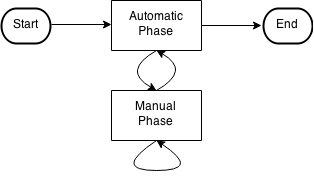

# Writing Jobs for Rodan

> Courtesy of ChatGPT

Jobs are modules that perform specific tasks within a Rodan workflow. These tasks can range from simple operations, such as converting an image to PNG format, to complex procedures like shape analysis and image recognition.

This guide introduces how to write jobs for Rodan so they can be integrated into workflows.

---

## Job Location

All job code should reside in the `rodan/jobs` directory. Within this directory are subdirectories (e.g., `gamera`, `neon`, etc.) representing different job packages. Each job package defines multiple Rodan jobs and may specify the resource types required by those jobs.

---

## 1. Describing a Rodan Job

A Rodan job is defined by a class that inherits from `rodan.jobs.base.RodanTask`. This class must declare the following attributes:

| Attribute           | Description                                                                                                                     |
| ------------------- | ------------------------------------------------------------------------------------------------------------------------------- |
| `name`              | `string` — A unique job name across all jobs provided by the vendor.                                                            |
| `author`            | `string` — The name of the job’s author.                                                                                        |
| `description`       | `string` — A description of what the job does.                                                                                  |
| `settings`          | [JSON Schema](http://json-schema.org/) — A validation schema for job settings. _(Only JSON objects are currently supported.)_   |
| `enabled`           | `boolean` — Indicates whether the job is available for use.                                                                     |
| `category`          | `string` — A category label for organizing jobs.                                                                                |
| `interactive`       | `boolean` — Specifies if the job involves manual input. _(Informational only; behavior is determined by the execution method.)_ |
| `input_port_types`  | `list of dict` — Defines input port configurations.                                                                             |
| `output_port_types` | `list of dict` — Defines output port configurations.                                                                            |

### Input/Output Port Configuration

Each entry in `input_port_types` and `output_port_types` must include:

| Key              | Description                                                                                                                       |
| ---------------- | --------------------------------------------------------------------------------------------------------------------------------- |
| `name`           | `string` — Port name.                                                                                                             |
| `resource_types` | `list of strings OR lambda: string -> boolean` — Allowed MIME types. A lambda filters types dynamically against Rodan's registry. |
| `minimum`        | `number` — Minimum number of required resources (0 = optional).                                                                   |
| `maximum`        | `number` — Maximum number of allowed resources (0 = unlimited).                                                                   |
| `is_list`        | `boolean` — Indicates whether this port handles a `Resource` or a `ResourceList`.                                                 |

---

## 2. Implementing the Job

Rodan jobs can have two execution phases:

1. **Automatic Phase** – Executes via distributed background workers.
2. **Manual Phase** – Interacts with a user via HTTP API (see [Interactive RunJob API](https://github.com/DDMAL/Rodan/wiki/Interactive-RunJob-API)).

Jobs always begin and end in an automatic phase but may alternate between the two.



### 2.1 Automatic Phase

The automatic phase is implemented via:

```python
run_my_task(self, inputs, settings, outputs)
```

#### Parameters

- `inputs` and `outputs` are Python dictionaries mapping port names to resource details.
- `settings` is a dictionary validated against the job’s JSON schema.

#### `inputs` Structure

Each key corresponds to a port name; values are lists of resource dictionaries:

| Key             | Value                                      |
| --------------- | ------------------------------------------ |
| `resource_path` | `string` — File path to the input resource |
| `resource_type` | `string` — MIME type of the input resource |

If `is_list` is `True`, the value is a list of resource lists.

**Example:**

```python
{
  "image": [
    {"resource_path": "/some/path/file1", "resource_type": "image/jpeg"},
    {"resource_path": "/some/path/file2", "resource_type": "image/png"}
  ],
  "mask": [
    [
      {"resource_path": "...", "resource_type": "image/bmp"},
      ...
    ],
    ...
  ]
}
```

#### `outputs` Structure

Similar to `inputs`, with additional distinctions:

| Key               | Description                                           |
| ----------------- | ----------------------------------------------------- |
| `resource_path`   | File path to be written (non-list types)              |
| `resource_folder` | Folder where output files are saved (list types only) |
| `resource_type`   | MIME type of the output                               |

**Note:** Output paths/folders do not exist beforehand. The job must create the files.

#### Error Handling

To customize error messages, implement:

```python
my_error_information(self, exc, traceback)
```

Returns a dictionary with:

- `error_summary`
- `error_details`

#### Temporary Files

Use the following pattern to ensure cleanup:

```python
with self.tempdir() as tempdir:
    # perform operations within tempdir
```

#### Return Values

Return `self.WAITING_FOR_INPUT({...})` to transition into a manual phase. Other return values are ignored.

---

### 2.2 Manual Phase

The job enters manual mode to serve and process HTTP requests. It implements:

#### `get_my_interface`

```python
get_my_interface(self, inputs, settings)
```

- Returns: `(template_path, context_dict)`
- Template path is relative to the job package and written in [Django Template Language](https://docs.djangoproject.com/en/1.7/topics/templates/).

##### `inputs` (manual phase)

Includes additional keys for display:

| Key                | Value                |
| ------------------ | -------------------- |
| `resource_url`     | URL to resource      |
| `small_thumb_url`  | Small thumbnail URL  |
| `medium_thumb_url` | Medium thumbnail URL |
| `large_thumb_url`  | Large thumbnail URL  |

##### Static Resources

Place static assets in `static/` inside the job directory.

Example:

```html
<link href="static/css/mystyle.css" rel="stylesheet" />
```

Use protocol-relative URLs (e.g., `//cdn...`) to avoid mixed content issues under HTTPS.

---

#### `validate_my_user_input`

```python
validate_my_user_input(self, inputs, settings, user_input)
```

- Validates POST data (`user_input`, JSON).
- Returns:

  - A dictionary of updated settings (keys must start with `@`)
  - Or `self.WAITING_FOR_INPUT({...})` to remain in manual phase
  - Can also include a response string:
    `self.WAITING_FOR_INPUT({...}, response="Continue working...")`

Raise `self.ManualPhaseException` to return an HTTP 400 error with a message.

---

### 2.3 Managing State Transitions

Use settings to track execution state across phases.

#### From Automatic to Manual:

```python
return self.WAITING_FOR_INPUT({'@phase': 'manual1'})
```

#### From Manual to Automatic:

```python
return {'@phase': 'auto2'}
```

**Important:** Only settings keys prefixed with `@` are preserved. Use these to determine the current phase inside `run_my_task` and `validate_my_user_input`.

---

## 3. Testing the Job

```python
test_my_task(self, testcase)
```

- Called during Rodan's unit tests.
- Constructs mock `inputs`, `settings`, and `outputs`.
- The `testcase` parameter is a [`unittest.TestCase`](https://docs.python.org/2/library/unittest.html) object.
- Use `testcase.new_available_path()` to generate unique file paths.

---

## 4. Defining Resource Types

Define custom MIME types in `resource_types.yaml` inside the vendor directory. Each entry is a dictionary:

| Key           | Description                                    |
| ------------- | ---------------------------------------------- |
| `mimetype`    | `string` — The MIME type string                |
| `description` | (optional) `string` — Description of the type  |
| `extension`   | (optional) `string` — Suggested file extension |

---

## 5. Importing Jobs

Rodan loads job packages based on the `RODAN_JOB_PACKAGES` list in `settings.py`.

Each job package must import its job modules in its `__init__.py` file. You don’t need to import job classes explicitly—just the modules containing them.

Use:

```python
from rodan.jobs.module_loader import module_loader
module_loader(__name__)
```

This safely catches and logs `ImportError` exceptions without crashing Rodan.
